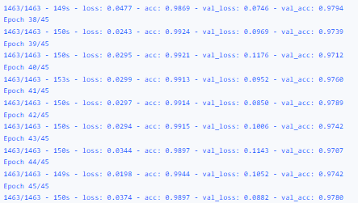

# Convolutional networks for fruit classification
*** 

### Task
***
>It is necessary to build and train a neural network on a data set with fruits

Create 3 functions:
1. Loading the training sample ` load_train()`
2. Creating the model `create_model()`
3. Running the  model `train_model()`

> Make sure that the accuracy value on the test sample is at least 90%

### Conclusions
***
The following actions were performed:
- Downloading data from the server in batches
- Added Augmentation to increase the sample and model quality
- Created a model by layers and replaced SGD with the ADAM algorithm
- Trained the model on a Tesla V100-SXM2-32GB GPU
- Achieved accuracy acc metric: 0.9897 with 45 training epochs

### Libraries
***
 - `tensorflow.keras`

